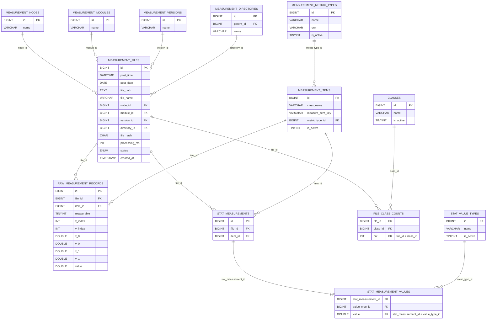

# Database Schema Overview

이 문서는 FastAPI 백엔드가 사용하는 MySQL 테이블 구조를 시각/텍스트로 정리합니다. raw 측정 데이터와 통계 측정 데이터가 `measurement_files`와 `measurement_items`를 중심으로 어떻게 연결되는지 한눈에 볼 수 있습니다.

## Entity Relationship Diagram



## Table Summaries

### measurement_files
- 한 번의 측정/인퍼런스 파일 메타데이터 (`post_time`, `file_path`, 디렉터리/파일명 정보, 해시, 처리시간, 상태 등).
- Raw/통계/클래스 정보는 모두 이 테이블의 `id`(= `file_id`)를 FK로 참조합니다.
- 노드/모듈/버전/디렉터리 보조 테이블을 통해 관련 메타 정보를 재사용합니다.

### measurement_nodes / measurement_modules / measurement_versions
- 장비 노드, 모듈, 버전 정보를 각각 저장하는 테이블입니다. 텍스트 natural key(`name`)로 식별하며, 신규 값은 API 호출 시 자동 생성됩니다.

### measurement_directories
- `parent_dir_0/1/2` 값을 정규화한 테이블입니다(레벨 + 이름). 파일은 dir0/1/2 FK로 각 디렉터리를 가리킵니다.

### measurement_metric_types
- `CD`, `LER` 등 측정 물리량과 단위를 정의합니다.
- 하나의 metric 은 여러 `measurement_items`를 가질 수 있습니다.

### measurement_items
- `class_name` + `measure_item_key` + `metric_type` 조합으로 측정 포인트를 식별합니다.
- Raw 샘플(`raw_measurement_records`)과 통계 헤더(`stat_measurements`)가 모두 `item_id`를 참조합니다.

### raw_measurement_records
- 실제 측정 샘플 데이터를 저장합니다.
- 주요 컬럼: `measurable`(True/False), `x_index`/`y_index`(격자 위치), `x_0`~`y_1`(좌표), `value`.
- `(file_id, item_id, x_index, y_index)`로 유니크 보장.

### stat_measurements & stat_measurement_values
- Raw 값에서 집계된 결과 세트(`stat_measurements`)와 각 통계 지표(`stat_measurement_values`).
- 예: `mean`, `stdev`, `p95` 등은 `stat_value_types`에서 정의.

### classes & file_class_counts
- Object detection/분류 결과에 사용할 수 있는 보조 테이블. 특정 파일이 어떤 클래스에 얼마나 매핑됐는지 `file_class_counts`에 저장합니다.

## 데이터 흐름 요약
1. 새로운 측정 파일을 수신하면 `measurement_files`에 메타데이터를 넣습니다.
2. 해당 작업에서 수집된 샘플을 `measurement_items`(class + item key)와 매칭해 `raw_measurement_records`에 저장합니다.
3. Raw 데이터를 요약한 통계는 `stat_measurements`에 헤더를 만들고, 각 통계 지표를 `stat_measurement_values`에 기록합니다.

이 구조로 Raw/통계 데이터를 분리해 저장하되, `measurement_files.id`와 `measurement_items.id`를 통해 일관된 조인을 유지할 수 있습니다.

## API Payload Examples

### POST /measurement-results

```json
{
  "file": {
    "post_time": "2024-05-20T08:00:00Z",
    "file_path": "/data/.../run1.csv",
    "node_name": "NODE_A",
    "module_name": "PROC_UNIT_1",
    "version_name": "2024.05",
    "parent_dir_0": "img",
    "parent_dir_1": "wafer123",
    "parent_dir_2": "line_a",
    "file_name": "run1.csv",
    "status": "OK"
  },
  "raw_measurements": [
    {
      "item": {
        "class_name": "DEFECT",
        "measure_item_key": "P1",
        "metric_type": {
          "name": "CD",
          "unit": "nm"
        }
      },
      "measurable": true,
      "x_index": 3,
      "y_index": 5,
      "x_0": 12.5,
      "y_0": 8.0,
      "x_1": 13.0,
      "y_1": 8.6,
      "value": 31.27
    }
  ],
  "stat_measurements": [
    {
      "item": {
        "class_name": "DEFECT",
        "measure_item_key": "P1",
        "metric_type": {
          "name": "CD",
          "unit": "nm"
        }
      },
      "values": [
        { "value_type_name": "AVG", "value": 31.27 },
        { "value_type_name": "STD", "value": 0.42 }
      ]
    }
  ],
  "class_counts": {
    "P1": 500,
    "P2": 170
  }
}
```

## Common Queries

Raw 샘플/통계 데이터를 조회할 때 사용할 수 있는 SQL 예시입니다.

### Raw Measurements with Context

```sql
SELECT
    mf.id            AS file_id,
    mf.file_name,
    mf.post_time,
    mi.class_name,
    mi.measure_item_key,
    mmt.name         AS metric_name,
    mmt.unit         AS metric_unit,
    rmr.measurable,
    rmr.x_index,
    rmr.y_index,
    rmr.x_0,
    rmr.y_0,
    rmr.x_1,
    rmr.y_1,
    rmr.value
FROM raw_measurement_records rmr
JOIN measurement_files mf      ON mf.id = rmr.file_id
JOIN measurement_items mi      ON mi.id = rmr.item_id
JOIN measurement_metric_types mmt ON mmt.id = mi.metric_type_id
ORDER BY mf.id, mi.id, rmr.y_index, rmr.x_index;
```

### Statistical Measurements with Values

```sql
SELECT
    mf.id             AS file_id,
    mf.file_name,
    mi.class_name,
    mi.measure_item_key,
    mmt.name          AS metric_name,
    mmt.unit          AS metric_unit,
    svt.name          AS stat_value_type,
    smv.value
FROM stat_measurements sm
JOIN measurement_files mf      ON mf.id = sm.file_id
JOIN measurement_items mi      ON mi.id = sm.item_id
JOIN measurement_metric_types mmt ON mmt.id = mi.metric_type_id
JOIN stat_measurement_values smv ON smv.stat_measurement_id = sm.id
JOIN stat_value_types svt    ON svt.id = smv.value_type_id
ORDER BY mf.id, mi.id, svt.name;
```

### File + Raw + Stat Overview

```sql
WITH raw_stats AS (
    SELECT
        rmr.file_id,
        COUNT(*)          AS raw_points,
        AVG(rmr.value)    AS raw_value_avg
    FROM raw_measurement_records rmr
    GROUP BY rmr.file_id
),
stat_totals AS (
    SELECT
        sm.file_id,
        COUNT(DISTINCT sm.id) AS stat_sets
    FROM stat_measurements sm
    GROUP BY sm.file_id
)
SELECT
    mf.id             AS file_id,
    mf.file_name,
    mf.post_time,
    mn.name           AS node,
    mm.name           AS module,
    mv.name           AS version,
    COALESCE(raw_stats.raw_points, 0) AS raw_points,
    COALESCE(raw_stats.raw_value_avg, 0) AS raw_value_avg,
    COALESCE(stat_totals.stat_sets, 0) AS stat_sets
FROM measurement_files mf
LEFT JOIN measurement_nodes   mn ON mn.id = mf.node_id
LEFT JOIN measurement_modules mm ON mm.id = mf.module_id
LEFT JOIN measurement_versions mv ON mv.id = mf.version_id
LEFT JOIN raw_stats        ON raw_stats.file_id = mf.id
LEFT JOIN stat_totals      ON stat_totals.file_id = mf.id
ORDER BY mf.post_time DESC;
```

### File Hierarchy Preview

```sql
WITH RECURSIVE directory_path AS (
    SELECT
        d.id,
        d.parent_id,
        d.name,
        CAST(d.name AS CHAR(1024)) AS full_path
    FROM measurement_directories d
    WHERE d.parent_id IS NULL
    UNION ALL
    SELECT
        child.id,
        child.parent_id,
        child.name,
        CONCAT(directory_path.full_path, '/', child.name) AS full_path
    FROM measurement_directories child
    JOIN directory_path ON directory_path.id = child.parent_id
)
SELECT
    mf.id AS file_id,
    mf.file_name,
    directory_path.full_path AS directory_path,
    mn.name AS node,
    mm.name AS module,
    mv.name AS version
FROM measurement_files mf
LEFT JOIN directory_path ON directory_path.id = mf.directory_id
LEFT JOIN measurement_nodes   mn ON mn.id = mf.node_id
LEFT JOIN measurement_modules mm ON mm.id = mf.module_id
LEFT JOIN measurement_versions mv ON mv.id = mf.version_id
ORDER BY directory_path.full_path, mf.file_name;
```
